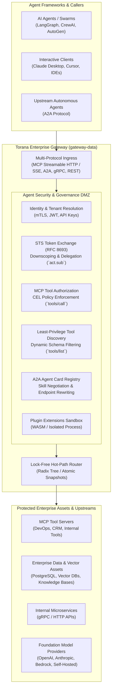

# Torana: The Enterprise Gateway for AI Agents

[](https://goreportcard.com/report/github.com/phaselume/torana)
[](LICENSE)

**Torana** is a high-performance, zero-trust security and policy gateway designed specifically for **Autonomous AI Agents**, **Agentic Tool Calling**, and **Enterprise Asset Access**. 

Written in Go (1.25+), Torana acts as the secure DMZ between autonomous agent frameworks (LangGraph, AutoGen, CrewAI, Claude Desktop, OpenAI Swarms) and enterprise environments—governing Model Context Protocol (MCP) tool execution, securing Agent-to-Agent (A2A) communications, and strictly mediating access to sensitive corporate databases, APIs, and knowledge assets.

---

## Why an AI Agent Gateway?

Traditional API gateways protect static REST endpoints. LLM proxies manage token rates and model failover. **AI Agents break both paradigms:**

1. **Non-Deterministic Execution**: Agents formulate their own plans and dynamically select which tools to call with arbitrary generated arguments.
2. **Confused Deputy & Privilege Escalation**: Agents acting on behalf of a human user can inadvertently trigger destructive tools (`drop_table`, `refund_payment`, `send_email`) or exfiltrate private data via tool parameters.
3. **Unfettered Asset Access**: Connecting an autonomous agent directly to databases, vector indexes, and internal microservices creates a massive attack surface.
4. **Multi-Hop Identity Loss**: In multi-agent systems (Agent A delegating to Agent B), original user identity and least-privilege context are lost without cryptographically bound token exchange.

Torana solves this by sitting inline on the hot path as an intelligent, policy-driven security perimeter.

---

## Architecture Overview



---

## Core Capabilities

### 1. Zero-Trust MCP Tool Calling & Least-Privilege Discovery
- **Dynamic Tool Filtering (`tools/list`)**: Intercepts MCP capability discovery. Agents only discover tools they are explicitly authorized to view based on caller identity, groups, and tenancy.
- **Granular Tool Authorization (`tools/call`)**: Enforces inline Common Expression Language (CEL) policies before any tool executes. Restricts invocations based on parameters, roles, and context.
- **Schema Validation & Parameter Sanitization**: Validates tool arguments against strict JSON schemas before forwarding requests to internal tool servers.

### 2. Governed Enterprise Asset & Data Access
- **Secure Egress Brokering**: Native, connection-pooled egress connectors for enterprise storage, PostgreSQL vector databases, internal gRPC/HTTP microservices, and remote MCP servers.
- **Payload Privacy by Design**: Prompts, tool arguments, completions, and asset contents never leave the local customer boundary. Only sanitized operational metadata is emitted to central management planes.
- **Streaming-First Architecture**: Byte-stream evaluation (`io.Reader`/`io.Writer`) with zero body buffering on the hot path unless required by security filters.

### 3. Agent Identity & Multi-Hop Delegation (STS)
- **RFC 8693 Security Token Service**: Downscopes tokens when agents delegate tasks to downstream sub-agents or tool workers.
- **Actor Claim Preservation (`act.sub`)**: Preserves the original human subject while identifying the acting agent chain, maintaining an unforgeable audit trail.
- **Multi-Tenant Isolation**: Cryptographic tenant boundaries prevent cross-tenant agent tool invocations or asset leakage.

### 4. Agent-to-Agent (A2A) Protocol Mesh
- **Agent Card Discovery**: Serves standard agent discovery cards at `/.well-known/agent-card.json` and `/.well-known/agent.json`.
- **Dynamic Skill Negotiation**: Filters agent capabilities and rewrites internal endpoint URLs to gateway-managed public proxies.
- **Autonomous Task Routing**: Manages bidirectional conversational messages and long-running asynchronous task handoffs between agents.

### 5. High-Performance, Cloud-Native Data Plane
- **Lock-Free Hot Path**: Active configuration, routes, and policies are held in immutable snapshots swapped via `sync/atomic.Pointer` with zero request-path locks and zero downtime.
- **WASM & OCI Plugin Sandboxing**: Extend gateway functionality via WebAssembly (`wazero`) or isolated out-of-process plugins without compromising memory safety.
- **Sub-Millisecond Overhead**: Pre-compiled radix matching, buffer pooling (`sync.Pool`), and bounded ring-buffer telemetry designed for latency-sensitive agent loops.

---

## Getting Started

### Prerequisites
- Go 1.25 or higher
- Make
- Docker (optional)

### Running Locally

```bash
# Clone the repository
git clone https://github.com/phaselume/torana.git
cd torana

# Run the gateway data plane
go run ./cmd/gateway-data

# Or build and run using Makefile
make build
./bin/gateway-data
```

### Running Tests, Benchmarks & Fuzzing

Torana includes comprehensive test suites across unit tests, hot-path benchmarks, chaos scenarios, and protocol fuzzers:

```bash
# Run unit and security tests with race detection
make test

# Run hot-path benchmarks
make bench

# Run protocol fuzzing (MCP JSON-RPC, CEL Compiler, Router)
make fuzz

# Run chaos and snapshot reload tests
make chaos
```

### Container Deployment

```bash
# Build the production Docker image
make docker-build

# Run the container
docker run -p 8080:8080 -p 8443:8443 gateway-data:latest
```

---

## Configuration Example: MCP Tool Policy

Torana snapshots arrive dynamically from the platform control plane or local configuration. Here is an example CEL policy governing agent tool execution:

```yaml
# Example: Restricting sensitive tools to authorized roles
rules:
  - id: "allow-read-only-tools"
    resource: "mcp_tool:*"
    action: "tools/call"
    expression: "ident.in_group('engineering') && resource.id.startsWith('read_')"
    verdict: ALLOW

  - id: "protect-production-db-tools"
    resource: "mcp_tool:database_execute_query"
    action: "tools/call"
    expression: "ident.in_group('dba') && !request.arguments.query.matches('(?i).*(drop|truncate|alter).*')"
    verdict: ALLOW
```

---

## Documentation & Architecture

- **[System Design & Performance Architecture](file:///Users/sanket/Projects/torana-enterprise/DESIGN.md)**: Deep dive into the lock-free pipeline, memory pooling, and snapshot compilation.
- **[Security Threat Model & Mitigations](file:///Users/sanket/Projects/torana-enterprise/SECURITY.md)**: Threat catalog (T1-T10), sandbox isolation guarantees, and token exchange security.

---

## License

Torana is open-source software licensed under the [Apache License 2.0](LICENSE).
